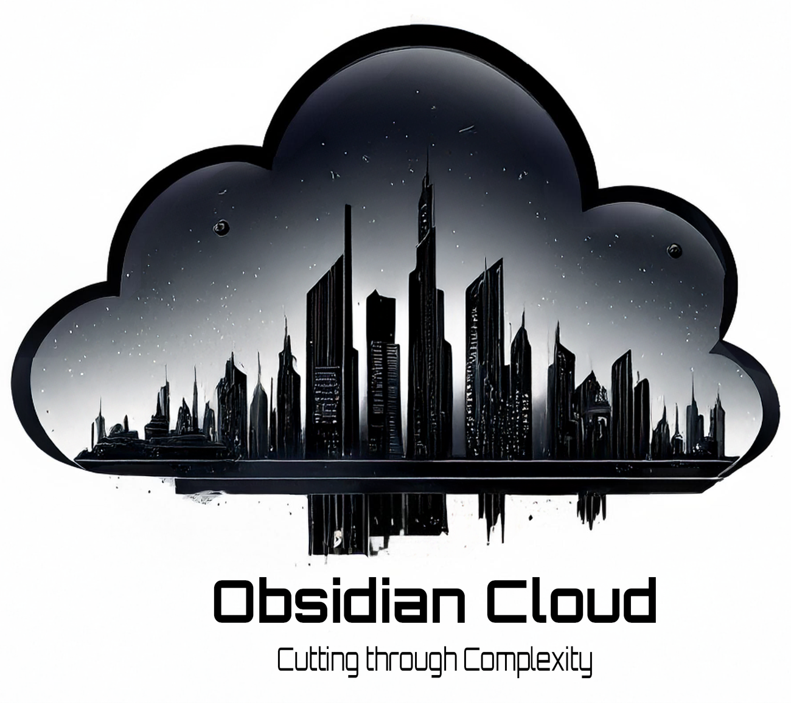

# **Obsidian Cloud**

## *Cutting through Complexity*

## 🚀 About Us

Obsidian Cloud is your strategic technology partner, specializing in **Cloud architecture**, **DevOps transformation**, and **AI/ML implementation** that drives real business value. We're not just another consulting firm – we cut through complexity to deliver scalable, secure, and efficient solutions.

### 📊 Our Impact

- **100+** Projects Delivered
- **40+** Cloud Migrations Completed  
- **25+** Enterprise Clients Served
- **15+** Years of Combined Experience

## 🛠️ Technology Stack

### Cloud Platforms

### Languages

### Frameworks & Libraries

### Configuration & Policy

### Infrastructure & DevOps

### CI/CD & Automation

### Monitoring & Observability

### AI/ML & Data

### Security & Compliance

### Web3 & Blockchain

## 🎯 Our Services

### ☁️ Cloud Architecture & Migration
- **Multi-cloud strategy development**
- **Infrastructure assessment & planning**
- **Zero-downtime migration execution**
- **Cost optimization & governance**
- **Security & compliance implementation**

### 🔄 DevOps & Automation
- **CI/CD pipeline design & implementation**
- **Infrastructure as Code (Terraform, CloudFormation)**
- **Container orchestration (Kubernetes, Docker)**
- **Monitoring & observability setup**
- **Automated testing & quality gates**

### 🧠 AI/ML & Data Engineering
- **ML model deployment & management**
- **AI-powered data pipelines**
- **Real-time ML inference systems**
- **Data lake & warehouse for AI/ML**
- **Traditional ETL/ELT automation**

### 🛡️ Security & Compliance
- **Zero-trust security implementation**
- **Vulnerability assessments & penetration testing**
- **Compliance automation (SOC2, GDPR, HIPAA)**
- **Identity & access management**
- **Security monitoring & incident response**

### ⚡ Serverless Architecture
- **Serverless application development**
- **Event-driven architecture design**
- **API development & management**
- **Function orchestration & workflows**
- **Performance optimization & monitoring**

### 📊 Monitoring & Observability
- **Application & infrastructure monitoring**
- **Distributed tracing implementation**
- **Custom dashboards & alerting**
- **Log aggregation & analysis**
- **Performance optimization insights**

### 🌐 Web3 & Blockchain Development
- **Solana smart contract development with Anchor framework**
- **DeFi protocol design and implementation**
- **SPL token creation and management**
- **Web3 dApp frontend development**
- **Blockchain infrastructure and RPC optimization**

## 🌟 Our Values

### 🎯 Precision Focus
We cut through the noise to deliver exactly what your business needs, when it needs it.

### ⚡ Lightning Fast
Rapid deployment and iteration cycles that keep you ahead of the competition.

### 👥 Expert Team
Senior engineers and architects with proven track records in enterprise environments.

### ✅ Proven Results
Measurable outcomes and ROI that justify your technology investments.

## 🚀 Why Choose Obsidian Cloud?

- **Cloud Native Expertise**: Deep knowledge across AWS, Azure, and GCP
- **DevOps Excellence**: Streamlined processes and automated workflows
- **AI Solution Engineering**: Modern AI/ML implementation and data engineering
- **Web3 & Blockchain Development**: Solana ecosystem expertise with Rust and Anchor
- **Security First**: Zero-trust architectures and compliance automation
- **Scalable Solutions**: Built for growth and enterprise-grade performance

## 📞 Get Started

Ready to transform your infrastructure? Let's discuss how our expertise can help you build scalable, secure, and efficient cloud solutions.

**Contact Us:**
- 🌐 Website: [obsidiancloud.io](https://obsidiancloud.io)
- 📧 Email: contact@obsidiancloud.io
- 💼 LinkedIn: [linkedin.com/company/obsidiancloud](https://linkedin.com/company/obsidiancloud)

---

**Transform your business with expert Cloud, DevOps, and AI/ML consulting.**

*We simplify the complex, accelerate innovation, and deliver results that matter.*

